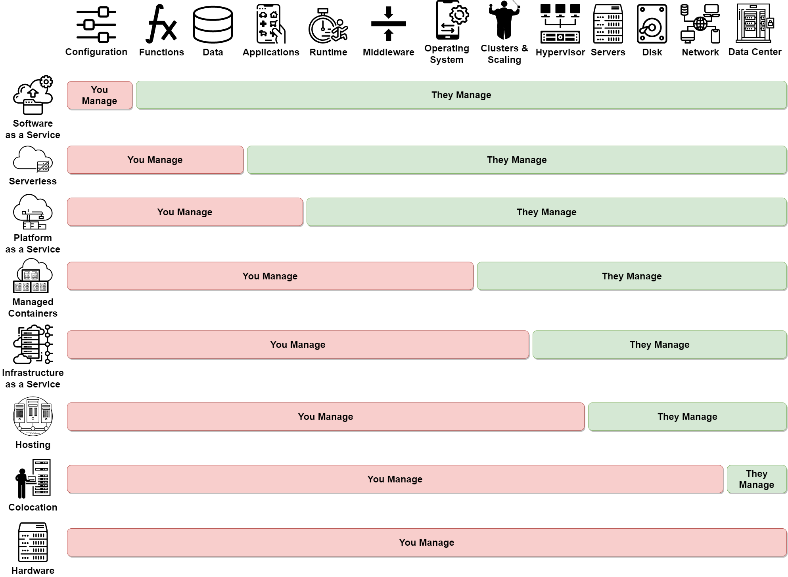

# Clouds

Following are some interesting cloud observations while developing basic, automated hello-world deployments for each.

## Defined

While each cloud provider provides their own definition for cloud computing (e.g. AWS, Azure, Google, RedHat, etc.), one historical standard was set forth by the [National Institute of Standards and Technology (NIST), U.S. Department of Commerce](https://www.nist.gov/), titled ["The NIST Definition of Cloud Computing"](https://csrc.nist.gov/publications/detail/sp/800-145/final).

??? note "The NIST Definition of Cloud Computing..."

    ### Essential Characteristics

    `On-demand self-service.`
    : A consumer can unilaterally provision computing capabilities, such as server time and network storage, as needed automatically without requiring human interaction with each service provider.

    `Broad network access.`
    : Capabilities are available over the network and accessed through standard mechanisms that promote use by heterogeneous thin or thick client platforms (e.g., mobile phones, tablets, laptops, and workstations).

    `Resource pooling.`
    : The provider's computing resources are pooled to serve multiple consumers using a multi-tenant model, with different physical and virtual resources dynamically assigned and reassigned according to consumer demand. There is a sense of location independence in that the customer generally has no control or knowledge over the exact location of the provided resources but may be able to specify location at a higher level of abstraction (e.g., country, state, or datacenter). Examples of resources include storage, processing, memory, and network bandwidth.

    `Rapid elasticity.`
    : Capabilities can be elastically provisioned and released, in some cases automatically, to scale rapidly outward and inward commensurate with demand. To the consumer, the capabilities available for provisioning often appear to be unlimited and can be appropriated in any quantity at any time.

    `Measured service.`
    : Cloud systems automatically control and optimize resource use by leveraging a metering capability at some level of abstraction appropriate to the type of service (e.g., storage, processing, bandwidth, and active user accounts). Resource usage can be monitored, controlled, and reported, providing transparency for both the provider and consumer of the utilized service.

    ### Service Models

    `Software as a Service (SaaS).`
    : The capability provided to the consumer is to use the provider's applications running on a cloud infrastructure. The applications are accessible from various client devices through either a thin client interface, such as a web browser (e.g., web-based email), or a program interface. The consumer does not manage or control the underlying cloud infrastructure including network, servers, operating systems, storage, or even individual application capabilities, with the possible exception of limited user - specific application configuration settings. Platform as a Service (PaaS). The capability provided to the consumer is to deploy onto the cloud infrastructure consumer -created or acquired applications created using programming languages, libraries, services, and tools supported by the provider. The consumer does not manage or control the underlying cloud infrastructure including network, servers, operating systems, or storage, but has control over the deployed applications and possibly configuration settings for the application-hosting environment.

    `Infrastructure as a Service (IaaS).`
    : The capability provided to the consumer is to provision processing, storage, networks, and other fundamental computing resources where the consumer is able to deploy and run arbitrary software, which can include operating systems and applications. The consumer does not manage or control the underlying cloud infrastructure but has control over operating systems, storage, and deployed applications; and possibly limited control of select networking components (e.g., host firewalls).

    ### Deployment Models

    `Private cloud.`
    : The cloud infrastructure is provisioned for exclusive use by a single organization comprising multiple consumers (e.g., business units) . It may be owned, managed, and operated by the organization, a third party, or some combination of them, and it may exist on or off premises.

    `Community cloud.`
    : The cloud infrastructure is provisioned for exclusive use by a specific community of consumers from organizations that have shared concerns (e.g., mission, security requirements, policy, and compliance considerations). It may be owned, managed, and operated by one or more of the organizations in the community, a third party, or some combination of them, and it may exist on or off premises.

    `Public cloud.`
    : The cloud infrastructure is provisioned for open use by the general public. It may be owned, managed, and operated by a business, academic, or government organization, or some combination of them. It exists on the premises of the cloud provider.

    `Hybrid cloud.`
    : The cloud infrastructure is a composition of two or more distinct cloud infrastructures (private, community, or public) that remain unique entities, but are bound together by standardized or proprietary technology that enables data and application portability (e.g., cloud bursting for load balancing between clouds).

### Cloud Deployment Types

Building on the NIST definitions, BMC has provided a list of things to consider when [comparing the cloud deployment types](https://www.bmc.com/blogs/public-private-hybrid-cloud/) below.

<figure markdown="block">

<figcaption>Key benefits &amp; drawbacks of cloud computing types</figcaption>
</figure>

Choosing a cloud abstraction is an architecture decision with significant impacts to end-to-end system design, development, testing, integration and deployment, and operations and support. Traditional models compare the ownership concerns when targeting on-site, Infrastructure as a Service (IaaS), Platform as a Service (PaaS), and/or Software as a Service (SaaS). However, cloud has continued to evolve and blur the boundaries between these deployment models. This project offers this example as a guide:

<figure markdown="block">

<figcaption>Cloud Computing Abstractions</figcaption>
</figure>

<figure markdown="block">

<figcaption>Cloud Computing Packages</figcaption>
</figure>

## Cloud Providers

### Amazon Web Services :fontawesome-brands-aws:

Register for a [free account](https://aws.amazon.com/free/).

!!! abstract ""

    - [About](https://aws.amazon.com/what-is-aws/)
    - [Architecture](https://aws.amazon.com/architecture/)
    - [Blueprints](https://docs.aws.amazon.com/solutions/latest/aws-blueprints/overview.html)
    - [Calculator](https://calculator.aws/)
    - [Compliance](https://aws.amazon.com/compliance/)
    - [Console / Portal / Dashboard](https://console.aws.amazon.com/)
    - [Containers](https://aws.amazon.com/containers/)
    - [Kubernetes](https://aws.amazon.com/eks/)
    - [Machine Learning](https://aws.amazon.com/machine-learning/)
    - [Marketplace](https://aws.amazon.com/marketplace)
    - [Platform as a Service (PaaS)](https://aws.amazon.com/elasticbeanstalk/)
    - [Serverless](https://aws.amazon.com/lambda/)
    - [Storage](https://docs.aws.amazon.com/whitepapers/latest/aws-overview/storage-services.html)
    - [Training / Learning / Education](https://aws.amazon.com/training/)
    - [Why?](https://aws.amazon.com/application-hosting/benefits/)
    - [What?](https://aws.amazon.com/what-is-aws/)

!!! bug "hello-cloud challenges"

    - PaaS support for .NET is severely limited, requiring a containerized deployment.
    - PaaS support for Java and Kotlin using Elastic Beanstalk and Corretto 11 complains during `eb deploy` with "Alert: The platform version that your environment is using isn't recommended. There's a recommended version in the same platform branch." This is because specifying `eb init --platform corretto-11 ...` defaults to version "3.2.7", when a newer platform version exists on AWS. [Contributions](./contribute.md) to fix this with a specific platform version are welcomed.

### Microsoft Azure :material-microsoft-azure:

Register for a [free account](https://azure.microsoft.com/en-us/free/).

!!! abstract ""

    - [About](https://azure.microsoft.com/en-us/)
    - [Architecture](https://docs.microsoft.com/en-us/azure/architecture/)
    - [Blueprints](https://docs.microsoft.com/en-us/azure/governance/blueprints/overview)
    - [Calculator](https://azure.microsoft.com/en-us/pricing/calculator/)
    - [Compliance](https://azure.microsoft.com/en-us/overview/trusted-cloud/compliance/)
    - [Console / Portal / Dashboard](https://portal.azure.com/)
    - [Containers](https://azure.microsoft.com/en-us/product-categories/containers/)
    - [Kubernetes](https://azure.microsoft.com/en-us/services/kubernetes-service/)
    - [Machine Learning](https://azure.microsoft.com/en-us/services/machine-learning/)
    - [Marketplace](https://azuremarketplace.microsoft.com/en-US/)
    - [Platform as a Service (PaaS)](https://azure.microsoft.com/en-us/overview/what-is-paas/)
    - [Serverless](https://azure.microsoft.com/en-us/services/functions/)
    - [Storage](https://docs.microsoft.com/en-us/azure/storage/common/storage-introduction)
    - [Training / Learning / Education](https://docs.microsoft.com/en-us/learn/azure/)
    - [Why?](https://azure.microsoft.com/en-us/overview/why-azure/)
    - [What?](https://azure.microsoft.com/en-us/overview/what-is-azure/)

!!! bug "hello-cloud challenges"

    - Java and Kotlin PaaS support was challenging as it seems they only support a Maven plug-in, eliminating the ability for projects that target Azure to use Gradle. This is an odd choice, considering Gradle is perhaps equally or more popular than Maven for modern development and the entire Android ecosystem utilizes Gradle.

### Google Cloud :material-google-cloud:

Register for a [free account](https://cloud.google.com/free).

!!! abstract ""

    - [About](https://cloud.google.com/docs/overview)
    - [Architecture](https://cloud.google.com/architecture)
    - [Blueprints](https://cloud.google.com/architecture?doctype=blueprint)
    - [Calculator](https://cloud.google.com/products/calculator)
    - [Compliance](https://cloud.google.com/security/compliance)
    - [Console / Portal / Dashboard](https://console.cloud.google.com/)
    - [Containers](https://cloud.google.com/containers)
    - [Kubernetes](https://cloud.google.com/kubernetes-engine)
    - [Machine Learning](https://cloud.google.com/products/ai)
    - [Marketplace](https://cloud.google.com/marketplace)
    - [Platform as a Service (PaaS)](https://aws.amazon.com/elasticbeanstalk/)
    - [Serverless](https://aws.amazon.com/lambda/)
    - [Storage](https://cloud.google.com/storage)
    - [Training / Learning / Education](https://cloud.google.com/training)
    - [Why?](https://cloud.google.com/why-google-cloud)
    - [What?](https://cloud.google.com/docs/overview)

!!! bug "hello-cloud challenges"

    - Automatically setting up and tearing down PaaS infrastructure seems "quirky" and idempotency is challenging.
    - The command `gcloud app deploy ...` does not properly ignore a "./Dockerfile", even if the "./app.yaml" specifies a standard runtime (not "custom" for docker containers) and the file "./.gcloudignore" explicitly ignores "Dockerfile".

### Salesforce Heroku :fontawesome-brands-salesforce:

Register for a [free account](https://www.heroku.com/free).

!!! abstract ""

    - [About](https://www.heroku.com/about)
    - [Architecture](https://devcenter.heroku.com/categories/heroku-architecture)
    - [Blueprints](https://www.salesforce.com/products/heroku/architecture/)
    - [Calculator](https://www.heroku.com/pricing)
    - [Compliance](https://www.heroku.com/compliance)
    - [Console / Portal / Dashboard](https://dashboard.heroku.com/)
    - [Containers](https://devcenter.heroku.com/articles/container-registry-and-runtime)
    - Kubernetes - not applicable. See ["converting Kubernetes to Heroku containers"](https://dev.to/heroku/converting-a-kubernetes-fullstack-application-to-heroku-containers-k3n).
    - Machine Learning - not applicable
    - [Marketplace](https://elements.heroku.com/)
    - [Platform as a Service (PaaS)](https://www.heroku.com/platform)
    - Serverless - not applicable
    - [Storage](https://elements.heroku.com/addons#data-stores)
    - [Training / Learning / Education](https://www.heroku.com/training-and-education)
    - [Why?](https://www.heroku.com/about)
    - [What?](https://www.heroku.com/what)

!!! bug "hello-cloud challenges"

    - Does not work out-of-the-box with monorepos, requiring the use of an unsupported [community user buildpack](https://github.com/lstoll/heroku-buildpack-monorepo). Heroku also uses a `git` repository to push code changes. Currently, the entire monorepo must be synchronized with the Heroku repo. As a result, the `heroku` CLI was containerized with just the application code, initializing an empty git repository within (local to) the container and the code files were added and committed. This was sufficient to synchronize the application with Heroku.
    - Heroku tooling complains when a "shallow clone" is made (e.g. `git clone --depth=1 ...`); history is required. Just like the monorepo problem, containerizing the `heroku` CLI and application code fix this as well.
    - .NET Core is not an officially supported language, requiring the use of an unsupported [community user buildpack](https://github.com/jincod/dotnetcore-buildpack). This is odd, considering C# has been in the top lists of programming languages for professional developers for several years.

## Technology

### Java :fontawesome-brands-java: and Kotlin :material-language-kotlin:

!!! bug "hello-cloud challenges"

    Some vendor Platform as a Service (PaaS) solutions are limited to Java 11 with Long-Term Support (LTS), despite the OpenJDK being released every 6 months including newer LTS versions (e.g. v17). Newer Java versions may use containers and examples are provided. See the [Oracle Java SE support roadmap](https://www.oracle.com/java/technologies/java-se-support-roadmap.html) :octicons-link-16: for more.
